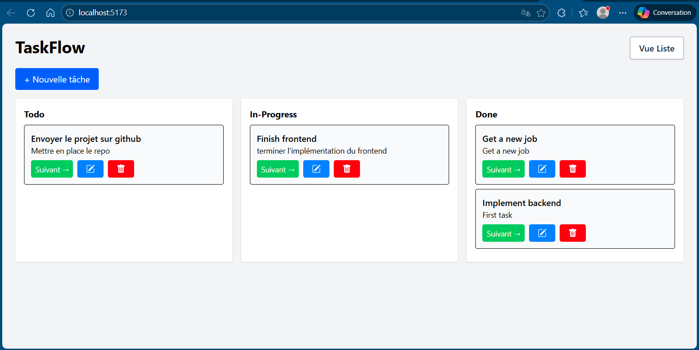
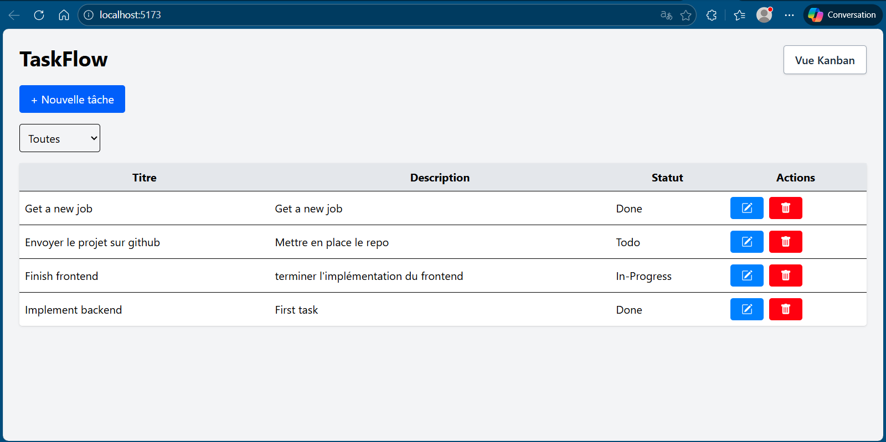
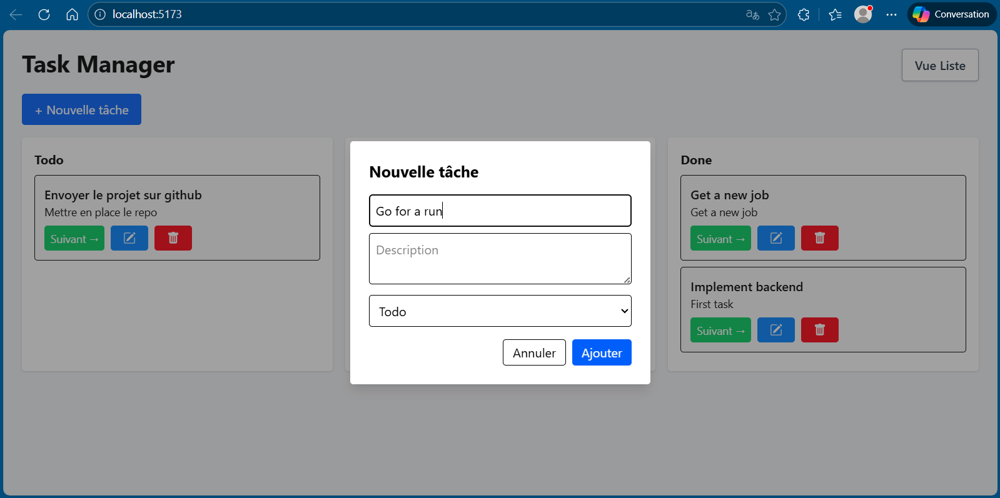

# Task Crud App

Pour mon entretien technique à E-business Afrique, j'ai eu à implémenter une application de gestion des tâches en laravel (backend) et react (frontend)

## Captures







## Prérequis

- PHP >= 8.1
- Composer
- MySQL ou PostgreSQL
- Laravel >= 10
- Node.js

## Installation

1. Cloner le projet :

```bash
git clone https://github.com/votre-repo/backend.git
cd backend
composer install
cp .env.example .env
php artisan key:generate
```

2. Configurer le fichier .env en l'associant avec une base de données MySQL préalablement créée. Exemple :
   
DB_CONNECTION=mysql
DB_HOST=127.0.0.1
DB_PORT=3306
DB_DATABASE=tasks_db
DB_USERNAME=admin
DB_PASSWORD=###

3. Lancer les migrations : 

```bash
php artisan migrate
```

4. Lancer le projet backend :

```bash
php artisan serve
```

5. Lancer le projet frontend :

Pour se faire, nous devons être à la racine du projet clôné pour aller vers le dossier frontend : 

```bash
cd ..
cd frontend
npm install
npm run dev
```


